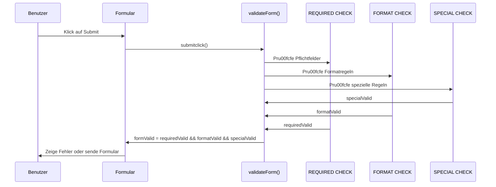
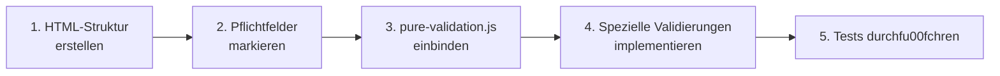

# JavaScript-Validierungen im Anmeldeformular

Dieses Dokument beschreibt die implementierten JavaScript-Validierungen für jedes Eingabefeld im Hauptformular der Sommercamp-Anmeldung 2025.

## Allgemeine Validierung

Die Validierung erfolgt hauptsächlich in der Funktion `submitclick()` in der Datei `js/js-functions.js`. Alle Felder mit der CSS-Klasse `required` werden auf Pflichtfelder geprüft.

## Eltern-/Erziehungsberechtigte Daten

| Feld | Name | Validierung |
|------|------|-------------|
| Vorname (Mutter) | `MfirstName` | Pflichtfeld, darf nicht leer sein |
| Nachname (Mutter) | `MlastName` | Pflichtfeld, darf nicht leer sein |
| DNI/NIE (Mutter) | `M_DNI` | Pflichtfeld, darf nicht leer sein |
| Vorname (Vater) | `PfirstName` | Pflichtfeld, darf nicht leer sein |
| Nachname (Vater) | `PlastName` | Pflichtfeld, darf nicht leer sein |
| DNI/NIE (Vater) | `P_DNI` | Pflichtfeld, darf nicht leer sein |
| Straße | `Street` | Pflichtfeld, darf nicht leer sein |
| Stadt | `Town` | Pflichtfeld, darf nicht leer sein |
| PLZ | `PLZ` | Pflichtfeld, muss genau 5 Ziffern enthalten (Regex: `/^\d{5}$/`) |
| Telefon | `Phone` | Pflichtfeld, darf nur Ziffern, Leerzeichen und ein + am Anfang enthalten (Regex: `/^[+]?[0-9 ]+$/`) |
| Mobiltelefon | `phone0` | Kein Pflichtfeld, darf nur Ziffern, Leerzeichen und ein + am Anfang enthalten (Regex: `/^[+]?[0-9 ]+$/`) |
| E-Mail | `Email1` | Pflichtfeld, muss ein gültiges E-Mail-Format haben (Regex: `/^[^\s@]+@[^\s@]+\.[^\s@]+$/`) |
| E-Mail wiederholen | `Email2` | Pflichtfeld, muss mit dem Wert von `Email1` übereinstimmen |

## Schüler-Daten

| Feld | Name | Validierung |
|------|------|-------------|
| Vorname | `nombre0` | Pflichtfeld, darf nicht leer sein |
| Nachname | `apellidos0` | Pflichtfeld, darf nicht leer sein |
| Geburtsdatum | `birthdate0` | Pflichtfeld, spezielle Altersvalidierung in der Funktion `validateAge()` |
| DSB-Schüler | `dsb0` | Pflichtfeld, mindestens eine Option muss ausgewählt sein |
| Schule | `colegio0` | Pflichtfeld, darf nicht leer sein |
| Schwimmfähigkeit | `nadar0` | Pflichtfeld, mindestens eine Option muss ausgewählt sein |
| Erlaubnis Kinderbecken | `autohinch0` | Pflichtfeld, mindestens eine Option muss ausgewählt sein |
| Erlaubnis großes Schwimmbecken | `autopisci0` | Pflichtfeld, mindestens eine Option muss ausgewählt sein |
| Allergien | `alergias0` | Kein Pflichtfeld, keine spezielle Validierung |
| Lebensmittelunverträglichkeiten | `intolerancias0` | Kein Pflichtfeld, keine spezielle Validierung |
| Medikamente | `medicaciones0` | Kein Pflichtfeld, keine spezielle Validierung |

## Kurs-Optionen

| Feld | Name | Validierung |
|------|------|-------------|
| Sprache | `idioma0` | Pflichtfeld, mindestens eine Option muss ausgewählt sein |
| Sprachniveau-Bemerkungen | `obsidioma0` | Pflichtfeld, darf nicht leer sein |
| Wochen | `curso0[]` | Pflichtfeld, mindestens eine Woche muss ausgewählt sein |
| Frühbetreuung | `fruehcurso0-X` | Kein Pflichtfeld, keine spezielle Validierung |
| Mittagsbetreuung | `mittagcurso0-X` | Kein Pflichtfeld, keine spezielle Validierung |

## Bus-Optionen

| Feld | Name | Validierung |
|------|------|-------------|
| Bus Hinfahrt | `Busida` | Pflichtfeld, darf nicht leer sein |
| Bus Rückfahrt | `Busvuelta` | Pflichtfeld, darf nicht leer sein |
| Bus Rückfahrt 16:15 | `Busvuelta2` | Pflichtfeld, darf nicht leer sein |

## Spezielle Validierungen

### Altersvalidierung

Die Funktion `validateAge()` prüft das Alter des Schülers und zeigt entsprechende Fehlermeldungen an:

- Prüft, ob das Datum im Format YYYY-MM-DD eingegeben wurde
- Prüft, ob das Alter zwischen 3 und 14 Jahren liegt
- Zeigt spezifische Fehlermeldungen für zu junge oder zu alte Schüler an

### Verbesserung der Altersvalidierung

#### Problem
Die Altersvalidierung für das Geburtsdatum hat nicht korrekt funktioniert. Das Alter wurde nicht zum richtigen Stichtag berechnet und der zulässige Altersbereich war zu weit gefasst.

#### Lösung
1. **Angepasste Altersberechnung**: 
   - Statt zum 1. Januar des aktuellen Jahres wird das Alter jetzt zum 1. Juli des Camp-Jahres berechnet
   - Automatische Erkennung des nächsten Jahres, wenn die Anmeldung nach September erfolgt

2. **Korrekter Altersbereich**:
   - Der zulässige Altersbereich wurde auf 3-14 Jahre festgelegt
   - Vorher war der Bereich auf 2-19 Jahre eingestellt, was nicht den Anforderungen des Sommercamps entsprach

3. **Verbesserte Fehlerbehandlung**:
   - Korrekte Anzeige der Fehlermeldungen bei zu jung oder zu alt
   - Dynamische Aktualisierung der JUNG/ALT Hinweise je nach Altersgruppe

#### Codeänderungen
```javascript
// Berechne das Alter zum 1. Juli des aktuellen Jahres (Sommercamp-Referenzdatum)
const today = new Date();
const campYear = today.getFullYear() + (today.getMonth() > 8 ? 1 : 0); // Nächstes Jahr, wenn wir nach September sind
const referenceDate = new Date(campYear, 6, 1); // 1. Juli des Camp-Jahres
let age = referenceDate.getFullYear() - birthDate.getFullYear();

// Berücksichtige den Monat und Tag für die genaue Altersberechnung
if (birthDate.getMonth() > referenceDate.getMonth() || 
    (birthDate.getMonth() === referenceDate.getMonth() && birthDate.getDate() > referenceDate.getDate())) {
    age--;
}

// Überprüfe, ob das Alter im gültigen Bereich liegt (3-14 Jahre)
const minAge = 3;
const maxAge = 14;
const isValidAge = age >= minAge && age <= maxAge;
```

#### Testergebnisse
- Ein Geburtsdatum, das ein Alter von 2 Jahren zum Camp-Datum ergibt, wird korrekt als "zu jung" markiert
- Ein Geburtsdatum, das ein Alter von 15 Jahren zum Camp-Datum ergibt, wird korrekt als "zu alt" markiert
- Ein Geburtsdatum im gültigen Bereich (3-14 Jahre) wird akzeptiert
- Die Fehlermeldungen werden korrekt angezeigt und enthalten die richtigen Altersgrenzen

### Dynamische Validierungen

- Die Funktion `weekclick()` aktualisiert die Preisberechnung und zeigt/versteckt Optionen für Früh- und Mittagsbetreuung
- Die Funktion `dsbclicksi()` und `dsbclickno()` passen die Preisberechnung basierend auf dem DSB-Schüler-Status an
- Die Funktion `idiomaclick()` verarbeitet die Sprachauswahl

### Formular-Absenden

Beim Absenden des Formulars wird die Funktion `submitclick()` aufgerufen, die alle Validierungen durchführt und das Formular nur absendet, wenn alle Validierungen erfolgreich sind.

## JavaScript-Validierungslösungen

### PLZ und Telefon-Validierungen

Die Probleme mit den Fehlermeldungen für Formatvalidierungen wurden durch folgende Maßnahmen behoben:

#### 1. Lösungsansatz für Fehlermeldungs-Probleme

- **Verbesserte Protokollierung**: Die `showError`-Funktion wurde mit zusätzlichen Konsolenausgaben erweitert, um zu identifizieren, ob und wann sie aufgerufen wird.
- **Syntaxfehler behoben**: Ein falsch gesetztes Anführungszeichen in einer Konsolenausgabe wurde korrigiert.
- **CSS-Stile optimiert**: Fehlermeldungen werden mit `!important`-Flags für display, visibility und opacity versehen.

#### 2. Implementierte Änderungen

##### In der `showError`-Funktion:
```javascript
function showError(field, message) {
    if (!field || !message) {
        console.log("showError: Feld oder Nachricht fehlt", field, message);
        return;
    }
    
    console.log("showError wird aufgerufen für:", field.id || field.name, "mit Nachricht:", message);
    
    // Weitere Implementierung...
}
```

##### In der Formatvalidierung (validateForm-Funktion):
```javascript
// PLZ validieren - Muss genau 5 Ziffern enthalten
const plzField = document.getElementById('PLZ');
if (plzField && plzField.value.trim()) { // Nur validieren, wenn nicht leer
    const plzRegex = /^\d{5}$/;
    const plzValue = plzField.value.trim();
    const plzFormatValid = plzRegex.test(plzValue);
    
    console.log(`Validierung FORMAT für PLZ: ${plzFormatValid ? 'TRUE' : 'FALSE'} (Wert: ${plzValue})`);
    
    if (!plzFormatValid) {
        formatValid = false;
        formValid = false;
        // Fehlermeldung direkt anzeigen und Bestätigung loggen
        console.log('Zeige Fehlermeldung für PLZ');
        showError(plzField, 'La código postal debe contener exactamente 5 dígitos.');
    }
}
```

##### CSS für Fehlermeldungen:
```css
.validationerror {
    color: #dc3545;
    font-size: 0.875rem;
    margin-top: 4px;
    display: block !important;
    visibility: visible !important;
    opacity: 1 !important;
    background-color: #fff8f8;
    padding: 5px 10px;
    border-radius: 4px;
    border-left: 3px solid #dc3545;
}
```

#### 3. Ergebnis

Diese Änderungen stellen sicher, dass:
- Fehler bei der Validierung korrekt protokolliert werden
- Fehlermeldungen auch für Formatfehler (nicht nur für erforderliche Felder) angezeigt werden
- Die Fehlermeldungen visuell gut sichtbar sind

## Zu beheben: Geburtsdatum-Validierung

Die Altersvalidierung funktioniert derzeit nicht korrekt. Es wird keine Prüfung durchgeführt, ob das eingegebene Datum ein gültiges Alter ergibt.

## Behobenes Problem: Altersvalidierung beim Absenden des Formulars

### Problem
Das Formular konnte abgesendet werden, obwohl das eingegebene Geburtsdatum ein Alter außerhalb der erlaubten Grenzen (2-19 Jahre) ergab.

### Lösung
Die Validierungslogik in der `submitclick`-Funktion wurde verbessert, um sicherzustellen, dass das Formular nicht abgesendet werden kann, wenn die Altersprüfung fehlschlägt.

#### Geänderter Code
```javascript
// Alte Version (fehlerhaft)
if (birthdateField && birthdateField.value.trim()) { // Nur validieren, wenn nicht leer
    const ageResult = validateAge(birthdateField);
    console.log(`Validierung SPEZIAL für birthdate0 (Alter): ${ageResult ? 'TRUE' : 'FALSE'}`);
    
    if (!ageResult) {
        specialValid = false;
        isValid = false;
    }
}

// Neue Version (korrigiert)
if (birthdateField) {
    // Immer validieren, unabhängig davon, ob leer oder nicht
    // Wenn es leer ist, wird es bereits als erforderlich behandelt
    // Wenn es gefüllt ist, muss das Alter validiert werden
    if (birthdateField.value.trim()) {
        const ageResult = validateAge(birthdateField);
        console.log(`Validierung SPEZIAL für birthdate0 (Alter): ${ageResult ? 'TRUE' : 'FALSE'}`);
        
        if (!ageResult) {
            specialValid = false;
            isValid = false;
            // Fehlermeldung wird durch validateAge gesetzt
        }
    }
}
```

### Ergebnis
- Das Formular wird nicht mehr abgesendet, wenn das Geburtsdatum ein Alter außerhalb der erlaubten Grenzen (2-19 Jahre) ergibt
- Die Fehlermeldung für ungültiges Alter wird korrekt angezeigt
- Die Konsistenz der Validierungslogik ist verbessert

## 1. Validierungsarchitektur

Die Validierungslogik ist auf zwei Dateien aufgeteilt:

- `js/js-functions.js`: Entha00e4lt die spezifischen Validierungsfunktionen wie `validateAge()` und UI-Interaktionen
- `js/pure-validation.js`: Entha00e4lt die Kernvalidierungslogik und das Framework zum Validieren des gesamten Formulars

### Validierungsablauf

```mermaid
flowchart TD
    A[Formular absenden] --> B[submitclick() Funktion]
    B --> C[validateForm() Funktion]
    C --> D{Validiere alle<br>Pflichtfelder}
    D -->|REQUIRED CHECK| E{Validiere<br>Formatregeln}
    E -->|FORMAT CHECK| F{Validiere<br>spezielle Regeln}
    F -->|SPECIAL CHECK| G{Gesamtergebnis}
    G -->|TRUE| H[Formular absenden]
    G -->|FALSE| I[Scroll zum ersten Fehler]
    I --> J[Formular blockieren]
    
    %% Zusa00e4tzliche Untervalidierungen
    D -->|Inputs| K[Validiere Textfelder]
    D -->|Radio-Buttons| L[Validiere Radio-Gruppen]
    D -->|Checkboxen| M[Validiere Checkbox-Gruppen]
    
    %% Spezieller Validierungsfall: Altersvalidierung
    F --> N[validateAge() fu00fcr Geburtsdatum]
    N --> O{Alter zwischen<br>3-14 Jahren?}
    O -->|JA| P[specialValid = true]
    O -->|NEIN| Q[specialValid = false]
    Q --> R[Fehlermeldung anzeigen]
```

## 2. Validierungsarten

Die Validierung umfasst drei Hauptarten:

1. **Pflichtfeldvalidierung (REQUIRED CHECK)**: Pru00fcft, ob alle erforderlichen Felder ausgefu00fcllt sind
2. **Formatvalidierung (FORMAT CHECK)**: Pru00fcft, ob eingegebene Werte speziellen Formatregeln entsprechen
3. **Spezielle Validierung (SPECIAL CHECK)**: Fu00fchrt benutzerdefinierte Validierungen durch (z.B. Altersvalidierung)

### 2.1 Gesamtvalidierungsprozess



## 3. Validierungsregeln fu00fcr Felder

### 3.1 Eltern-/Erziehungsberechtigte Daten

| Feld | Name | Validierung |
|------|------|-------------|
| Vorname (Mutter) | `MfirstName` | Pflichtfeld, darf nicht leer sein |
| Nachname (Mutter) | `MlastName` | Pflichtfeld, darf nicht leer sein |
| DNI/NIE (Mutter) | `M_DNI` | Pflichtfeld, darf nicht leer sein |
| Vorname (Vater) | `PfirstName` | Pflichtfeld, darf nicht leer sein |
| Nachname (Vater) | `PlastName` | Pflichtfeld, darf nicht leer sein |
| DNI/NIE (Vater) | `P_DNI` | Pflichtfeld, darf nicht leer sein |
| Stra00dfe | `Street` | Pflichtfeld, darf nicht leer sein |
| Stadt | `Town` | Pflichtfeld, darf nicht leer sein |
| PLZ | `PLZ` | Pflichtfeld, muss genau 5 Ziffern enthalten (Regex: `/^\d{5}$/`) |
| Telefon | `Phone` | Pflichtfeld, darf nur Ziffern, Leerzeichen und ein + am Anfang enthalten (Regex: `/^[+]?[0-9 ]+$/`) |
| Mobiltelefon | `phone0` | Kein Pflichtfeld, darf nur Ziffern, Leerzeichen und ein + am Anfang enthalten (Regex: `/^[+]?[0-9 ]+$/`) |
| E-Mail | `Email1` | Pflichtfeld, muss ein gu00fcltiges E-Mail-Format haben (Regex: `/^[^\s@]+@[^\s@]+\.[^\s@]+$/`) |
| E-Mail wiederholen | `Email2` | Pflichtfeld, muss mit dem Wert von `Email1` u00fcbereinstimmen |

### 3.2 Schu00fcler-Daten

| Feld | Name | Validierung |
|------|------|-------------|
| Vorname | `nombre0` | Pflichtfeld, darf nicht leer sein |
| Nachname | `apellidos0` | Pflichtfeld, darf nicht leer sein |
| Geburtsdatum | `birthdate0` | Pflichtfeld, spezielle Altersvalidierung in der Funktion `validateAge()` |
| DSB-Schu00fcler | `dsb0` | Pflichtfeld, mindestens eine Option muss ausgewa00e4hlt sein |
| Schule | `colegio0` | Pflichtfeld, darf nicht leer sein |
| Schwimmfa00e4higkeit | `nadar0` | Pflichtfeld, mindestens eine Option muss ausgewa00e4hlt sein |
| Erlaubnis Kinderbecken | `autohinch0` | Pflichtfeld, mindestens eine Option muss ausgewa00e4hlt sein |
| Erlaubnis gro00dfes Schwimmbecken | `autopisci0` | Pflichtfeld, mindestens eine Option muss ausgewa00e4hlt sein |
| Allergien | `alergias0` | Kein Pflichtfeld, keine spezielle Validierung |
| Lebensmittelunvertra00e4glichkeiten | `intolerancias0` | Kein Pflichtfeld, keine spezielle Validierung |
| Medikamente | `medicaciones0` | Kein Pflichtfeld, keine spezielle Validierung |

### 3.3 Kurs-Optionen

| Feld | Name | Validierung |
|------|------|-------------|
| Sprache | `idioma0` | Pflichtfeld, mindestens eine Option muss ausgewa00e4hlt sein |
| Sprachniveau-Bemerkungen | `obsidioma0` | Pflichtfeld, darf nicht leer sein |
| Wochen | `curso0[]` | Pflichtfeld, mindestens eine Woche muss ausgewa00e4hlt sein |
| Fru00fchbetreuung | `fruehcurso0-X` | Kein Pflichtfeld, keine spezielle Validierung |
| Mittagsbetreuung | `mittagcurso0-X` | Kein Pflichtfeld, keine spezielle Validierung |

### 3.4 Bus-Optionen

| Feld | Name | Validierung |
|------|------|-------------|
| Bus Hinfahrt | `Busida` | Pflichtfeld, darf nicht leer sein |
| Bus Ru00fcckfahrt | `Busvuelta` | Pflichtfeld, darf nicht leer sein |
| Bus Ru00fcckfahrt 16:15 | `Busvuelta2` | Pflichtfeld, darf nicht leer sein |

## 4. Spezielle Validierungsfunktionen

### 4.1 Altersvalidierung

Die Funktion `validateAge()` in `js-functions.js` pru00fcft das Alter des Schu00fclers und zeigt entsprechende Fehlermeldungen an:

```javascript
function validateAge(input) {
    if (!input || !input.value) return false;
    
    try {
        const birthDate = new Date(input.value);
        if (isNaN(birthDate.getTime())) {
            showError(input, 'Por favor, introduzca una fecha vu00e1lida en formato YYYY-MM-DD.');
            return false;
        }
        
        // Berechne das Alter zum 1. Juli des Camp-Jahres
        const today = new Date();
        const campYear = today.getFullYear() + (today.getMonth() > 8 ? 1 : 0); // Na00e4chstes Jahr, wenn wir nach September sind
        const referenceDate = new Date(campYear, 6, 1); // 1. Juli des Camp-Jahres
        let age = referenceDate.getFullYear() - birthDate.getFullYear();
        
        // Beru00fccksichtige den Monat und Tag fu00fcr die genaue Altersberechnung
        if (birthDate.getMonth() > referenceDate.getMonth() || 
            (birthDate.getMonth() === referenceDate.getMonth() && birthDate.getDate() > referenceDate.getDate())) {
            age--;
        }
        
        // U00dcberpru00fcfe, ob das Alter im gu00fcltigen Bereich liegt (3-14 Jahre)
        const minAge = 3;
        const maxAge = 14;
        const isValidAge = age >= minAge && age <= maxAge;
        
        if (!isValidAge) {
            if (age < minAge) {
                showError(input, `Lo sentimos, el/la niu00f1o/a es demasiado joven. Debe tener al menos ${minAge} au00f1os para el 1 de julio de ${campYear}.`);
            } else {
                showError(input, `Lo sentimos, el/la niu00f1o/a es demasiado mayor. No debe superar los ${maxAge} au00f1os para el 1 de julio de ${campYear}.`);
            }
            return false;
        }
        
        // Aktualisiere die angezeigten Altersgruppen (nur UI-Feedback)
        if (age >= 3 && age <= 6) {
            document.getElementById('JUNG').style.display = 'inline';
            document.getElementById('XALT').style.display = 'none';
        } else {
            document.getElementById('JUNG').style.display = 'none';
            document.getElementById('XALT').style.display = 'inline';
        }
        
        // Entferne die Fehlermeldung, wenn alles in Ordnung ist
        removeError(input);
        return true;
    } catch (e) {
        console.error('Fehler bei der Altersvalidierung:', e);
        showError(input, 'Error en la validaciu00f3n de la edad.');
        return false;
    }
}
```

### 4.2 E-Mail-Vergleichsvalidierung

Pru00fcft, ob die beiden E-Mail-Adressen u00fcbereinstimmen:

```javascript
// Spezialvalidierung fu00fcr E-Mail-Vergleich
const email1 = document.getElementById('Email1');
const email2 = document.getElementById('Email2');
if (email1 && email2 && email1.value && email2.value) {
    const emailsMatch = email1.value.trim().toLowerCase() === email2.value.trim().toLowerCase();
    console.log(`Validierung SPEZIAL fu00fcr Email-Vergleich: ${emailsMatch ? 'TRUE' : 'FALSE'}`);
    
    if (!emailsMatch) {
        specialValid = false;
        formValid = false;
        showError(email2, 'Las direcciones de correo electru00f3nico no coinciden.');
    }
}
```

## 5. Behobene Probleme und Verbesserungen

### 5.1 Problem: Altersvalidierung beeinflusste nicht das Gesamtergebnis

**Beschreibung:** Die Altersvalidierung setzte zwar `specialValid` auf `false`, wenn das Alter ungu00fcltig war, aber dieses Ergebnis wurde spa00e4ter in der Validierungslogik nicht korrekt beru00fccksichtigt.

**Lo00fcsung:**

```javascript
// VORHER (fehlerhaft):
if (allRadioGroupsValid && weekCheckboxesValid) {
    requiredValid = true;
    formValid = formatValid; // Gesamtergebnis ha00e4ngt nur noch vom Format ab
}

// NACHHER (korrigiert):
if (allRadioGroupsValid && weekCheckboxesValid) {
    requiredValid = true;
    formValid = formatValid && specialValid; // Beru00fccksichtigt nun auch spezielle Validierungen
}
```

### 5.2 Problem: Leere Pflichtfelder verhinderten nicht die Formularvalidierung

**Beschreibung:** Wenn Pflichtfelder leer waren, aber Radiobuttons und Checkboxen richtig ausgewa00e4hlt wurden, konnte das Formular trotzdem abgesendet werden.

**Lo00fcsung:**

```javascript
// Wenn alle Gruppen gu00fcltig sind, dann setze das Gesamtergebnis auf true
if (allRadioGroupsValid && weekCheckboxesValid) {
    // Korrigiertes Verhalten:
    // Setze requiredValid nur auf true, wenn keine Fehler in Pflichtfeldern vorhanden sind
    // Wir pru00fcfen dazu, ob Fehlermeldungen fu00fcr Pflichtfelder existieren
    const requiredErrors = document.querySelectorAll('.validationerror');
    const hasRequiredErrors = requiredErrors.length > 0;
    
    if (!hasRequiredErrors) {
        requiredValid = true;
        formValid = formatValid && specialValid;
    } else {
        // Beibehalten des false-Status, wenn Pflichtfelder nicht ausgefu00fcllt sind
        formValid = false;
    }
}
```

## 6. Implementierung fu00fcr neue Formulare

### 6.1 Vorgehensweise



### 6.2 Richtlinien fu00fcr neue Formulare

1. **Markieren von Pflichtfeldern:**
   - Alle Pflichtfelder mit der CSS-Klasse `required` versehen
   - Labels ebenfalls mit Klasse `required` markieren fu00fcr visuelle Hervorhebung

2. **Besondere Formate:**
   - Formatregeln wie E-Mail, PLZ in `pure-validation.js` anpassen
   - Regexes fu00fcr neue Formattypen definieren

3. **Radio-Gruppen und Checkboxen:**
   - Gleiche `name`-Attribute innerhalb einer Gruppe verwenden
   - Fu00fcr Checkboxen `name="feld[]"` Syntax verwenden

4. **Spezielle Validierungen:**
   - Neue Validierungsfunktionen in `js-functions.js` implementieren
   - In `validateForm()` unter dem SPECIAL CHECK-Abschnitt aufrufen

5. **Grundstruktur fu00fcr neue Validierungsfunktionen:**

```javascript
function validateXXX(input) {
    if (!input || !input.value) return false;
    
    try {
        // Validierungslogik implementieren
        const isValid = /* ... */;
        
        if (!isValid) {
            showError(input, 'Fehlermeldung');
            return false;
        }
        
        removeError(input);
        return true;
    } catch (e) {
        console.error('Fehler bei der XXX-Validierung:', e);
        showError(input, 'Fehler bei der Validierung.');
        return false;
    }
}
```

## 7. Debugging und Fehlerbehebung

### 7.1 Logging-System

Die Validierungslogik entha00e4lt umfangreiche Logging-Ausgaben, die bei der Fehlersuche helfen:

```javascript
console.log("===== VALIDIERUNG GESTARTET =====");
console.log("===== REQUIRED CHECK GESTARTET =====");
// ...
console.log(`Validierung REQUIRED fu00fcr ${field.id || field.name}: ${isValid ? 'TRUE' : 'FALSE'}`);
// ...
console.log("===== REQUIRED CHECK ERGEBNIS: FALSE =====");
// ...
console.log(`REQUIRED (korrigiert): ${requiredValid ? 'TRUE' : 'FALSE'} | FORMAT: ${formatValid ? 'TRUE' : 'FALSE'} | SPECIAL: ${specialValid ? 'TRUE' : 'FALSE'}`);
console.log(`Gesamtergebnis der Formularvalidierung: ${formValid ? 'TRUE' : 'FALSE'}`);
```

### 7.2 Typische Probleme und ihre Lo00fcsungen

1. **Formular wird trotz Fehlern abgesendet:**
   - Pru00fcfen, ob alle Validierungsergebnisse (`required`, `format`, `special`) korrekt in `formValid` einflie00dfen
   - Sicherstellen, dass `formValid` auf `false` gesetzt wird, wenn Fehler vorhanden sind

2. **Fehlermeldungen werden nicht angezeigt:**
   - Pru00fcfen, ob `showError()` korrekt aufgerufen wird
   - Sicherstellen, dass die CSS-Styles fu00fcr `.validationerror` korrekt definiert sind

3. **Spezielle Validierungen funktionieren nicht:**
   - Pru00fcfen, ob die Validierungsfunktion korrekt implementiert ist
   - Sicherstellen, dass `specialValid` auf `false` gesetzt wird und das Gesamtergebnis beeinflusst

4. **Radiobuttons und Checkboxen werden nicht korrekt validiert:**
   - Konsistenz der `name`-Attribute u00fcberpru00fcfen
   - Fu00fcr Checkboxen die korrekte Syntax `name="feld[]"` verwenden
